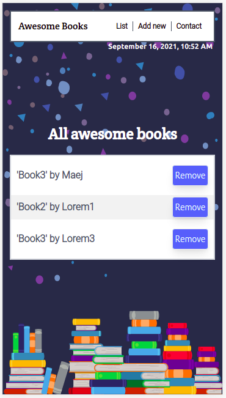
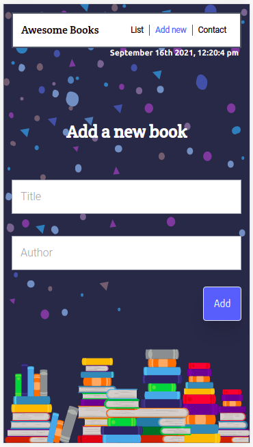

# microverse-awesome-books-project-one

> This project is on HTML + JAVASCRIPT. One can create a book, save it to the browser's local storage and can remove a specific book from the array and update the local storage.

Awesome Books                                                                                                              |
:-------------------------------------------------------------------------------------------------------------------------:|
                                                                                            |

List View (Mobile Version)               | Add View (Mobile Version)              |Contact View (Mobile Version)           |
:---------------------------------------:|:--------------------------------------:|:---------------------------------------|
       |      |      |

## Built With

- HTML & JAVASCRIPT

## Online Version
[Demo](https://mmsesay.github.io/awesome-books/)

## Authors

👤 **Author: Muhammad Mustapha Sesay**

- GitHub: [@mmsesay](https://github.com/mmsesay)
- Twitter: [@DeeMaejor](https://twitter.com/DeeMaejor)
- LinkedIn: [LinkedIn](https://linkedin.com/in/muhammad-m-sesay)

## 🤝 Contributing

Contributions, issues, and feature requests are welcome!

Feel free to check the [issues page](../../issues/).

## Show your support

Give a ⭐️ if you like this project!

## Acknowledgments
- microverseinc for the readme template
- grmarc at [freepik](http://www.freepik.com) for the book design
## 📝 License

This project is [MIT](./MIT.md) licensed.
